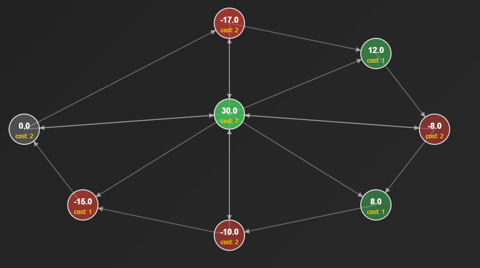
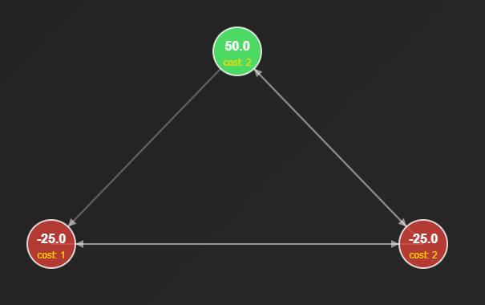
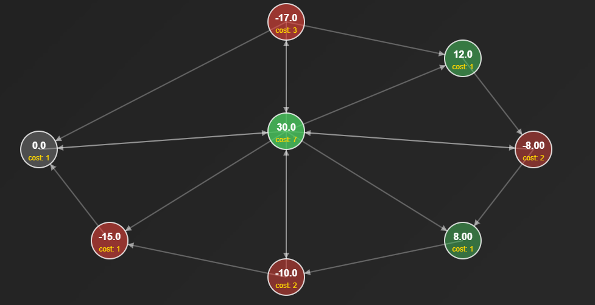

Consider the following problem on a directed graph:

% explain the problem

Now, is this NP-hard? how does the optimal sequence of moves looks like?

Here we consider a small example, and try different techniques to see how far can we push it. You might ask, what's the reason to consider this problem? Is it relevant for some real world task? Indeed that is the case. But we won' t get into it, since that spoils the fun. 

The goal here is to use different techniques to solve this problem, from the basic naives one, i.e. brute force search, to elegant genetic algorithms. What can we lear from the, very heavily computed, optimal moves from tiny examples? We will try to come up with simple heuristics that can be applied to bigger instances. 

Let's consider this instance of the problem with $8$ nodes:

But now, some tiny examples where we can reach zero cash in finite steps (and a theorem)

 

(reversed the edge 7 to 1)

In the first case, it's clear that the initial cash was conviniently placed. But on the second? 

If we list all cycles that graph, they are not disjoint: the central node is in the intersection of all cycles! This is equivalent to say that, any sufficientyly long walk on this graph, will hit the central node: you cannot avoid it, after a while you are forced to visit it, no matter what you try to do. Then it's easy to see that all the cash will flow into that node, in a finite amout of steps. But cash sums to zero, hence we reach a zero l1 norm! The strategy is simply never update the central node, and update all the others, until all cash reaches it! We call such nodes _perfect sinks_, for obvious reasons.

Actually, this is a characterization of isntances where we can finish always in finite time. Clearly, if we start with zero cash everywhere, regardless of the graph, we will finish in zero steps (which is a finite number).

**Theorem** The following are equivalent:
- G has at least a perfect sink
- Any cash configuration on G can reach zero cash in finite steps

For what we said, it's easy to convince that with a perfect sink we can always find a strategy that fully drains the cash in a finite number of steps. For the converse, the crucial observation is that if we don't have a perfect sink, then we must have two disjoint cycles. But cycles acts as a "trap" for cash: say that a cycles contains only positive cash. Then no matter what happens, by updating nodes of the cycles, you cannot push away all the cash. A tiny, vanishing fraction will always reamin trapped in there. Then, if we initialzie the cash putting all positive in a cycle, and all negative in another disjoint cycle, you can never obtain a full cancellation.

Having a perfect sink is an easy thing to check. But unfortunately, a very rare thing to observe, at least in for big graphs.

But given a initial cash distribution, can we easily say if there exists a sequence that drain the cash in finite time? In the example without perfect sink, this is indeed the case: the genetic algorithm found it! [1, 4, 7, 4, 5, 4, 6, 4, 6, 7, 4, 1, 0, 7, 7, 6, 7, 2, 1, 6, 2, 6, 2, 3, 0, 4] (remove zero cash moves)